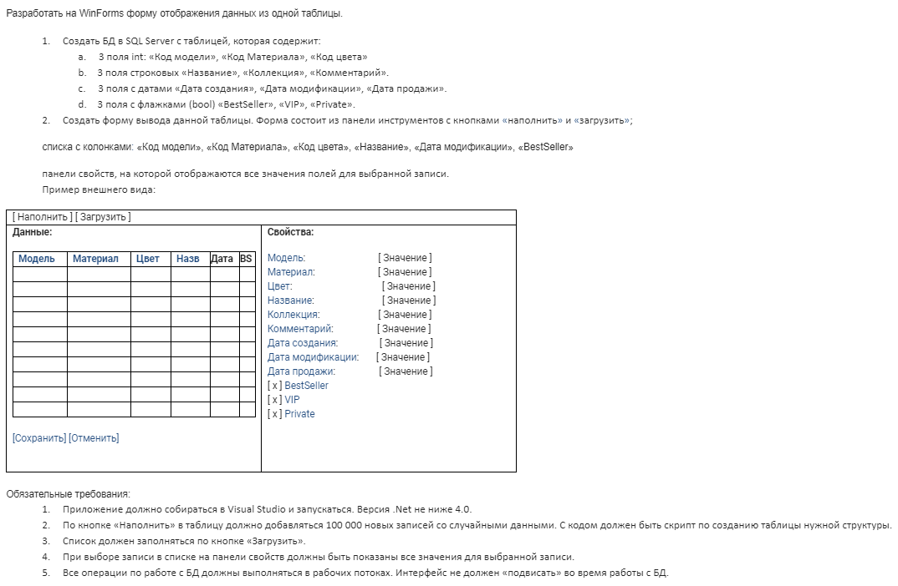

# Mercury.Shop
* Использования GridView в VirtualMode для работы с большими коллекциями
* Использование async/await with Cancel для длительных асинхронных операций
* Использование паттерна Model View Presenter
* Использование RowVersion для optimistic concurrency

